<p align="center">
  
  <h1 align="center">🎙️ Samantha</h1>
  <p align="center"><strong>Voice assistant for AI coding tools with wake word detection</strong></p>
  <p align="center">
    <em>Inspired by the AI from the movie "Her"</em>
  </p>
</p>

---

Samantha enables hands-free voice conversations with AI coding assistants (Claude, Gemini, Copilot, Aider, and more). Just say **"Hey Samantha"** to start talking, and **"Samantha sleep"** to take a break.

> 🙏 Thanks to [Mike Bailey](https://github.com/mbailey) for creating [VoiceMode](https://github.com/mbailey/voicemode) - the original project this is based on.

## ✨ Features

- **Wake word activation** - Say "Hey Samantha" to start talking
- **Always listening** - Works with your laptop mic, no headphones needed
- **Natural conversation** - Speak freely, pauses are detected automatically
- **Voice control** - Interrupt, skip, or put her to sleep with voice commands
- **Cross-platform** - Works on macOS, Linux, and Windows

### How It Works



```mermaid
graph TB
    START([Start]) -->|/samantha start| IDLE

    subgraph IDLE[💤 Idle]
        I[Listening for wake word]
    end

    subgraph ACTIVE[🟢 Active - Listening]
        A1[🎙️ Record] --> A2[Transcribe]
        A2 --> A3[Inject to AI]
        A3 --> A4[AI responds]
        A4 --> A5[🔊 TTS speaks]
        A5 --> A1
    end

    IDLE -->|Hey Samantha| ACTIVE
    ACTIVE -->|Samantha sleep| IDLE
    IDLE -->|/samantha stop| STOP([Stopped])
    ACTIVE -->|/samantha stop| STOP
```

## 🚀 Quick Start

### 1. Install Samantha

```bash
pip install git+https://github.com/goncaloneves/samantha.git
```

### 2. Install Voice Services

```bash
samantha-install install
```

This installs local speech recognition (Whisper) and text-to-speech (Kokoro).

### 3. Add to Your AI Tool

For Claude Code:
```bash
claude mcp add samantha -- samantha
```

For other AI tools, add Samantha to your MCP configuration (see [Multi-AI Support](#-multi-ai-support)).

### 4. Start Talking

In your AI tool, type `/samantha:start` to begin. Then just say **"Hey Samantha"** followed by your question or request.

## 📖 How to Use Samantha

### Starting a Conversation

1. **Start voice mode**: Type `/samantha:start` in your AI tool
2. **Activate**: Say **"Hey Samantha"** (or just **"Samantha"**) anywhere in your sentence
3. **Speak**: Talk naturally - your message is sent after 1 second of silence
4. **Listen**: Samantha responds via voice

### During a Conversation

Once activated, Samantha stays active and listens for your next message. You don't need to say "Hey Samantha" again until you put her to sleep.

| Say this... | To do this... |
|-------------|---------------|
| *"that's all"* or *"send it"* | Send your message immediately (without waiting for silence) |
| *"skip"* or *"continue"* | Skip to the next queued message |
| *"stop"* or *"quiet"* | Stop speaking and clear all queued messages |

### Ending a Conversation

| Say this... | What happens |
|-------------|--------------|
| **"Samantha sleep"** or **"Goodbye Samantha"** | Samantha goes idle but keeps listening for "Hey Samantha" |
| Type `/samantha:stop` | Stops voice mode completely (stops listening) |

**The difference**: "Samantha sleep" lets you reactivate anytime by saying "Hey Samantha" again. `/samantha:stop` turns off voice mode entirely.

## 🎯 Quick Reference

```
/samantha:start              # Start voice mode (begin listening)
"Hey Samantha, ..."          # Activate and speak
"that's all"                 # Send message immediately
"skip"                       # Skip to next message in queue
"stop"                       # Stop all speaking, clear queue
"Samantha sleep"             # Go idle (still listening for wake word)
/samantha:stop               # Stop voice mode completely
```

## ⚙️ Configuration

Create `~/.samantha/config.json` to customize:

```json
{
  "voice": "af_aoede",
  "wake_words": ["hey samantha", "samantha", "hey sam"],
  "deactivation_words": ["samantha sleep", "goodbye samantha"],
  "theodore": true,
  "restore_focus": true,
  "min_audio_energy": 3000,
  "target_app": null,
  "injection_mode": "auto",
  "ai_process_pattern": "claude|gemini|copilot|aider|chatgpt|gpt|sgpt|codex",
  "ai_window_titles": ["claude", "gemini", "copilot", "aider", "chatgpt", "gpt"]
}
```

### Settings Explained

| Setting | Description | Default |
|---------|-------------|---------|
| `voice` | TTS voice to use | `af_aoede` |
| `wake_words` | Phrases that activate Samantha | `hey samantha`, `samantha` |
| `deactivation_words` | Phrases that put Samantha to sleep | `samantha sleep`, `goodbye samantha` |
| `theodore` | Call you "Theodore" like in the movie | `true` |
| `restore_focus` | Return to your previous app after injection | `true` |
| `min_audio_energy` | Audio threshold to filter background noise | `3000` |
| `target_app` | Force injection into a specific app (e.g., `Cursor`, `Terminal`) | Auto-detect |
| `injection_mode` | `auto` (try extension, then CLI), `extension`, or `cli` | `auto` |
| `ai_process_pattern` | Regex pattern to detect AI CLI processes | `claude\|gemini\|copilot\|...` |
| `ai_window_titles` | Window titles to search for AI terminals | `["claude", "gemini", ...]` |
| `input_device` | Microphone device index | System default |
| `output_device` | Speaker device index | System default |

### Environment Variables

All settings can also be set via environment variables with the `SAMANTHA_` prefix:

```bash
export SAMANTHA_VOICE="af_aoede"
export SAMANTHA_WAKE_WORDS="hey sam,sam"
export SAMANTHA_THEODORE="false"  # Use gender-neutral language
```

Config file takes precedence over environment variables.

### Voice Options

Available voices: `af_aoede` (default), `af_sky`, `af_heart`, `af_bella`, `af_nova`, `af_nicole`, `af_kore`, `bf_emma`, `bf_isabella`

### Laptop Mic Support (No Headphones Required)

Samantha works great with your laptop's built-in microphone - no headphones or external mic needed. The `min_audio_energy` setting intelligently filters background noise so you can type, click, and work normally while Samantha listens for your voice.

| Value | Use Case |
|-------|----------|
| `1500` | Headset mic in quiet environment |
| `3000` | Laptop mic, filters typing noise (default) |
| `5000` | Noisy environment, requires clearer speech |

## 🖥️ Platform Support

| Platform | Status |
|----------|--------|
| **macOS** | Full support |
| **Linux (X11)** | Full support (requires `xclip`, `xdotool`) |
| **Linux (Wayland)** | Partial support (requires `wl-copy`, `ydotool`) |
| **Windows** | Full support |

### Supported Apps

Samantha can inject your voice commands into:

- **IDEs**: Cursor, VS Code, Windsurf, IntelliJ IDEA, PyCharm, WebStorm, and other JetBrains IDEs
- **Terminals**: Terminal, iTerm2, Warp, Alacritty, kitty, and more

By default, Samantha auto-detects which app to use (IDEs preferred over terminals).

## 🤖 Multi-AI Support

**By default, Samantha works with ALL major AI CLIs** - no configuration needed:

| AI Tool | Command | Auto-detected? |
|---------|---------|----------------|
| **Claude Code** | `claude` | ✅ Yes |
| **Gemini CLI** | `gemini` | ✅ Yes |
| **GitHub Copilot** | `copilot` | ✅ Yes |
| **Aider** | `aider` | ✅ Yes |
| **ChatGPT CLI** | `chatgpt` | ✅ Yes |
| **ShellGPT** | `sgpt` | ✅ Yes |
| **OpenAI Codex** | `codex` | ✅ Yes |

### MCP Setup

Add Samantha to your AI tool's MCP configuration:

| AI Tool | Setup Command |
|---------|---------------|
| **Claude Code** | `claude mcp add samantha -- samantha` |
| **Gemini CLI** | `gemini mcp add samantha -- samantha` |
| **Other AI CLIs** | Add to your MCP config file (see your AI's docs) |

### How It Works

Out of the box, Samantha detects **any** of these AIs automatically. The default pattern is:

```
claude|gemini|copilot|aider|chatgpt|gpt|sgpt|codex
```

**You don't need to configure anything** - just install Samantha, add it to your AI's MCP config, and it will detect whichever AI you're running.

### Custom AI Configuration

To use with a specific AI or custom CLI tool:

```json
{
  "ai_process_pattern": "my-custom-ai",
  "ai_window_titles": ["my-custom-ai"]
}
```

The `ai_process_pattern` is a regex used to detect running AI processes.
The `ai_window_titles` is a list of window title substrings to search for.

### App Injection Setup

Configure where Samantha injects your voice commands in `~/.samantha/config.json`:

#### Option 1: Auto Mode (Default)

Leave settings at defaults. Samantha will try injection methods in order:
1. **Extension mode** - AI extension panel (if any AI from `ai_process_pattern` is running)
2. **CLI mode** - IDE's integrated terminal (if any AI CLI is running there)
3. **Standalone terminal** - External terminal app (as final fallback)

```json
{
  "target_app": null,
  "injection_mode": "auto"
}
```

With `target_app: null`, Samantha auto-detects any running AI that matches `ai_process_pattern` (Claude, Gemini, Copilot, etc.).

#### Option 2: Force a Specific App

Set `target_app` to always inject into a specific app:

```json
{
  "target_app": "Cursor",
  "injection_mode": "auto"
}
```

**Valid `target_app` values:**
| IDEs | Terminals |
|------|-----------|
| `Cursor` | `Terminal` |
| `Code` (VS Code) | `iTerm2` |
| `VSCodium` | `Warp` |
| `Windsurf` | `Alacritty` |
| `IntelliJ IDEA` | `kitty` |
| `PyCharm` | `Hyper` |
| `WebStorm` | `WezTerm` |
| `PhpStorm` | `Konsole` |
| `RubyMine` | `GNOME Terminal` |
| `GoLand` | `Tilix` |
| `Rider` | `Windows Terminal` |
| `CLion` | `PowerShell` |
| `DataGrip` | `cmd` |

#### Option 3: Extension Mode (AI Extension Panel)

If you use an AI extension panel (like Claude Code) instead of CLI in terminal:

```json
{
  "target_app": "Cursor",
  "injection_mode": "extension"
}
```

This focuses the AI extension panel (`Cmd+Escape` shortcut) instead of the integrated terminal.

### Injection Modes

| Mode | Default | Description |
|------|---------|-------------|
| `auto` | Yes | Try extension first, then CLI, then standalone terminal |
| `extension` | No | Only use AI extension panel (`Cmd+Escape`) |
| `cli` | No | Only use IDE's integrated terminal (`Ctrl+``) |

**Smart detection:** In `auto` and `cli` modes, Samantha verifies an AI CLI is running in the **specific IDE's terminal** (not just any terminal) by tracing the process tree. This prevents injecting into the wrong terminal.

## 🔧 CLI Commands

```bash
samantha-install install              # Install Whisper + Kokoro
samantha-install install -m base      # Use smaller Whisper model (142MB)
samantha-install install --force      # Reinstall everything
samantha-install status               # Check service status
samantha-install download-model medium  # Download different Whisper model
```

### Whisper Models

| Model | Size | Accuracy | Speed |
|-------|------|----------|-------|
| tiny | 74MB | Low | Fast |
| base | 142MB | Medium | Fast |
| **small** | **466MB** | **Good (default)** | **Balanced** |
| medium | 1.5GB | Better | Slower |
| large | 3GB | Best | Slowest |

## 🔧 MCP Tools

For developers integrating Samantha:

| Tool | Description |
|------|-------------|
| `samantha_start` | Start voice mode |
| `samantha_stop` | Stop voice mode |
| `samantha_speak` | Speak text via TTS |
| `samantha_status` | Check voice mode status |

## 🔬 Technical Details

- **Speech detection**: WebRTC VAD (Voice Activity Detection)
- **Speech-to-text**: Whisper running locally on port 2022
- **Text-to-speech**: Kokoro running locally on port 8880
- **Audio**: Records at 24kHz, resamples to 16kHz for processing
- **Silence detection**: 1 second threshold triggers message send
- **Echo prevention**: Filters out TTS playback from mic input

For IDEs, Samantha sends `Cmd+Escape` (macOS) or `Ctrl+Escape` (Linux/Windows) to focus the AI extension input field before pasting.

## 📄 License

MIT
